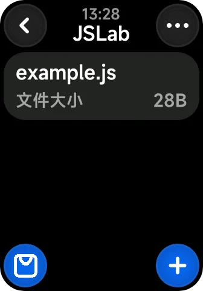
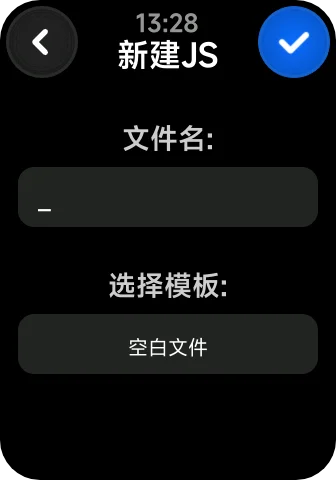
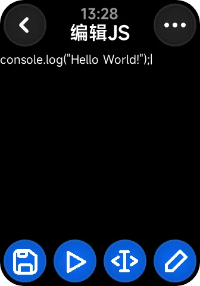
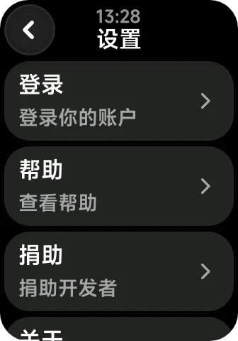

# JSLab

## 关于许可证变更的声明：
- 自 1.1.0 版本起，本软件许可证从 MIT（含附加条款）变更为 [GPL-3.0](https://www.gnu.org/licenses/gpl-3.0)。使用 1.1.0 及更高版本需遵守 GPL-3.0 条款（包括开源衍生作品要求），而 1.0.x 及更早版本仍受原许可证约束。

这是一个 Vela 快应用，适用于 Xiaomi Smart Band 9 Pro

通过此快应用，你可以在手环上编写和运行JavaScript

访问[米坛社区](https://www.bandbbs.cn/resources/3440/)，查看更多信息

## 全新UI 全新重构



## Feature：

- 实现代码存储

- 实现脚本运行

- 调整了喵喵输入法，使其更适用于JS编写

- 添加了光标支持

- 重新实现console.log

- 实现脚本调用系统API

- 实现用户输入函数


## TODO：

- 输入法实现内置JS关键字

- 实现脚本分享、脚本市场


## 快速上手

### 1. 开发

```
npm install
npm run start
```

### 2. 构建

```
npm run build
npm run release
```

### 3. 调试

```
npm run watch
```

