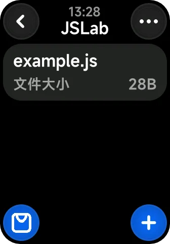
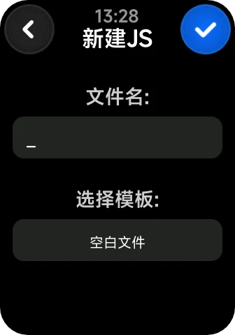
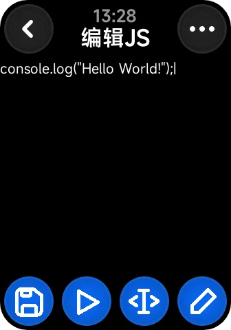
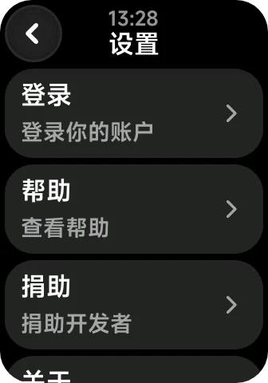
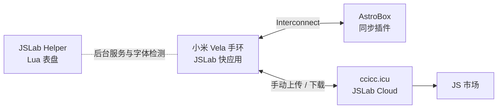

<div align="center">
  
  <h1>JSLab</h1>
  <p>在手腕上编写、运行和管理 JavaScript</p>
  <p>
    <a href="https://github.com/cciccicu/JSLab"></a>
    <a href="LICENSE"></a>
    <a href="docs/architecture.md"></a>
  </p>
</div>

JSLab 是一个面向小米 Vela 手环的 JavaScript 开发环境。它把编辑器、脚本运行时、AstroBox 配套端和云端工作区组合成一条完整的创作链路：脚本可以在手环上编写和运行，也可以通过电脑传输、保存到云空间并发布到市场。

> 本项目仍处于持续开发阶段。

## 目录

- [你可以用 JSLab 做什么](#你可以用-jslab-做什么)
- [界面预览](#界面预览)
- [项目组成](#项目组成)
- [快速开始](#快速开始)
- [开发边界](#开发边界)
- [文档](#文档)

## 你可以用 JSLab 做什么

| 场景 | 能力 |
| --- | --- |
| 手环编程 | 创建、编辑、运行、保存、重命名和删除 `.js` 文件（已有 `.ui.js` 名字保留） |
| 统一运行器 | 所有脚本注入 console/ui/dialog/script/system；UI 返回日志，轻点日志恢复；右上完整重载 |
| 编辑体验 | V2 编辑器支持字体、字号、语法高亮和高亮阈值；大文件或高亮关闭时自动采用低节点文本渲染 |
| 电脑协作 | AstroBox 插件支持脚本和字体的浏览、新建、编辑、上传、下载、重命名与删除，并提供分块传输和断线恢复 |
| 云端工作区 | 云空间按网盘模型保存当前文件；仅在用户主动操作时上传或下载，不执行自动同步 |
| JS 市场 | 浏览详情、查看作者、下载源码、保存到云空间；从云空间发布时自动填充代码，其余市场信息仍由用户填写 |
| 设备与账户 | 手环发起配对，网页输入配对码或扫描二维码确认；支持激活、充值、AI 代码生成和 Token 计费 |
| 表盘协作 | JSLab Helper Lua 表盘显示时间与动画，并从快应用端发起字体安装和表盘存活检测 |

## 界面预览

<div align="center">
  <table>
    <tr>
      <td align="center"><br /><sub>主页</sub></td>
      <td align="center"><br /><sub>新建文件</sub></td>
    </tr>
    <tr>
      <td align="center"><br /><sub>代码编辑器</sub></td>
      <td align="center"><br /><sub>设置</sub></td>
    </tr>
  </table>
</div>

## 项目组成

```text
JSLab/
├─ vela-quickapp/          手环端 Vela 快应用（.rpk）
├─ astrobox-plugin-sync/   AstroBox 同步插件（.abp）
├─ ccicc-plugin-cloud/     ccicc.icu 云端插件与开发 Kit（.zip）
├─ vela-luawatchface/      JSLab Helper Lua 表盘（.face）
└─ docs/                   架构、职责和交付说明
```


```mermaid
flowchart LR
    Watch["小米 Vela 手环<br/>JSLab 快应用"] <-->|Interconnect| AB["AstroBox<br/>同步插件"]
    Watch <-->|手动上传 / 下载| Cloud["ccicc.icu<br/>JSLab Cloud"]
    Cloud --> Market[JS 市场]
    Face["JSLab Helper<br/>Lua 表盘"] -.后台服务与字体检测.- Watch
```

四个项目各自维护构建系统和运行时边界。详细的所有权关系与交付产物见[项目架构](docs/architecture.md)。

## 快速开始

### 构建手环端

```powershell
cd vela-quickapp
npm install
npm run lint
npm run release
```

输出为 `dist/*.rpk`。需要 Node.js 和 AIoT 快应用工具链。

### 构建 AstroBox 插件

```powershell
cd ..\astrobox-plugin-sync
.\build.ps1
```

输出为 `JSLab-Sync.abp`。Rust 工具链需要安装 `wasm32-wasip2` target。

### 打包云端插件

```powershell
cd ..\ccicc-plugin-cloud\jslab-cloud
npm test
npm run pack -- .\ .\dist\jslab-cloud-0.5.1.zip
```

云端插件安装到 ccicc.icu 后，可在 `/jslab-cloud/workspace` 使用云空间和市场功能。

### 构建 Lua 表盘

```powershell
cd ..\..\vela-luawatchface
python -m pip install -r requirements.txt
.\scripts\build_face.ps1
```

输出为 `bin\JSLab Helper.face`。`pushlua.ps1` 可用于 ADB 部署和热重载。

## 开发边界

- 手环与云端之间没有自动同步，所有文件传输都由用户明确发起；
- AstroBox 通过 Host API 和 Interconnect 工作，不读取快应用私有目录；
- 云端市场条目是独立发布快照，删除云空间文件不会删除已发布内容；
- 生成 API 和审核 API 分开配置，服务端不会把服务商密钥、系统提示词或设备 Token 下发到脚本；
- Lua 表盘是独立运行时资源，不会打入手环 `.rpk` 或 AstroBox `.abp`；

## 文档

- [项目架构与职责边界](docs/architecture.md)
- [手环端 UI API](vela-quickapp/docs/UI_API.md)
- [统一脚本运行契约](vela-quickapp/docs/runtime-api.md)
- [手环端开发说明](vela-quickapp/README.md)
- [AstroBox 同步插件](astrobox-plugin-sync/README.md)
- [云端插件与市场](ccicc-plugin-cloud/README.md)
- [Lua 表盘](vela-luawatchface/README.md)

## 许可证

JSLab 采用 [GPL-3.0](LICENSE) 许可证。使用、修改或分发本项目及其衍生作品时，请遵守许可证条款。
